

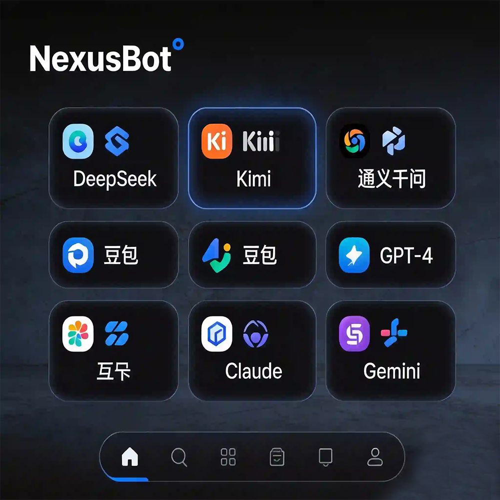

<h1><strong>NexusBot</strong></h1>

中国版 OpenClaw · 永久免费

全天候智能流程自动化引擎

  <a href="https://www.neuxsbot.com">官网</a> · 
  <a href="https://www.neuxsbot.com/docs">文档</a> · 
  <a href="https://www.neuxsbot.com">下载</a>

---

## 桌面部署，移动操控，赋予业务持久智能动力

破晓时分，当第一缕晨曦轻抚窗棂，您的数字化助理已悄然完成昨日数据归集、关键邮件处理与当日议程的智能编排。

---

## 重新定义自动化：NexusBot 核心理念

依托全球前沿开源项目 **OpenClaw** 进行深度优化，专为中文用户打造的零门槛、开箱即用型智能数字生产力平台。

NexusBot 重塑 AI 助手范式：**由响应式问答工具演进为前瞻式自主执行代理。**

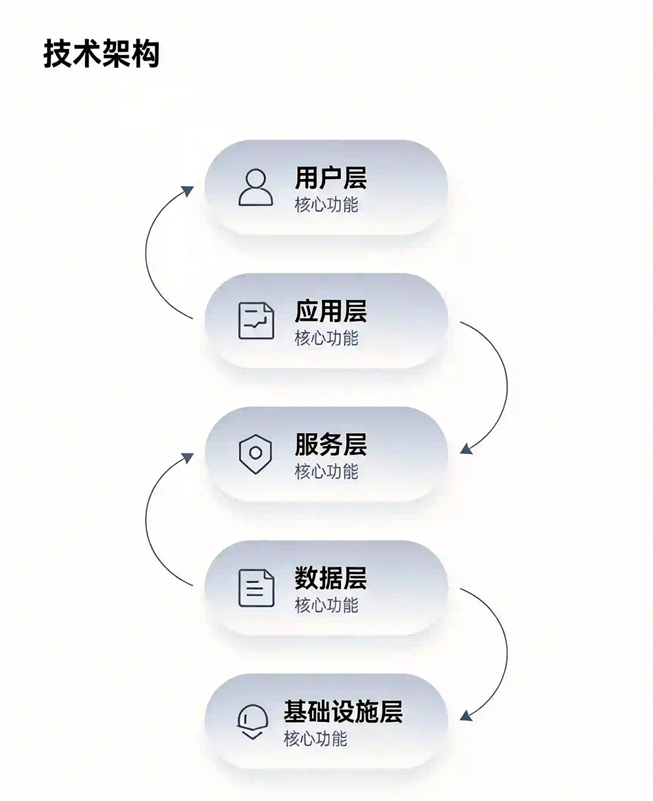

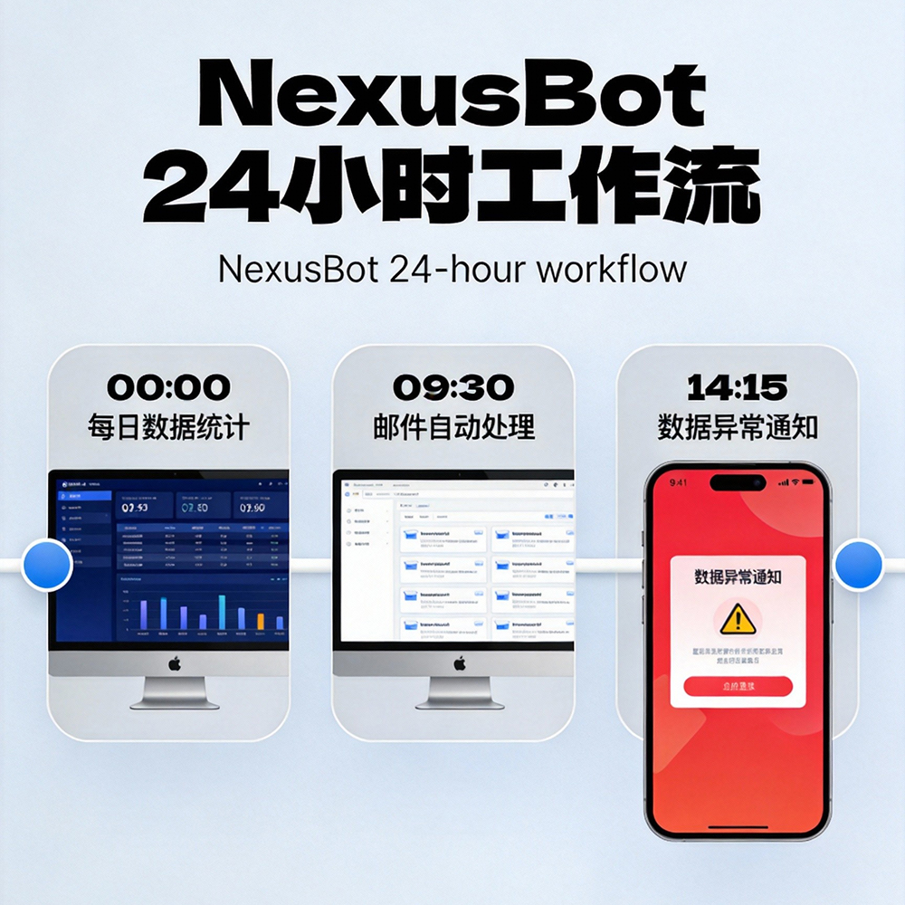

---

## NexusBot 与传统自动化工具的差异

**本地化部署、真实物理操作、数据主权完整独立**

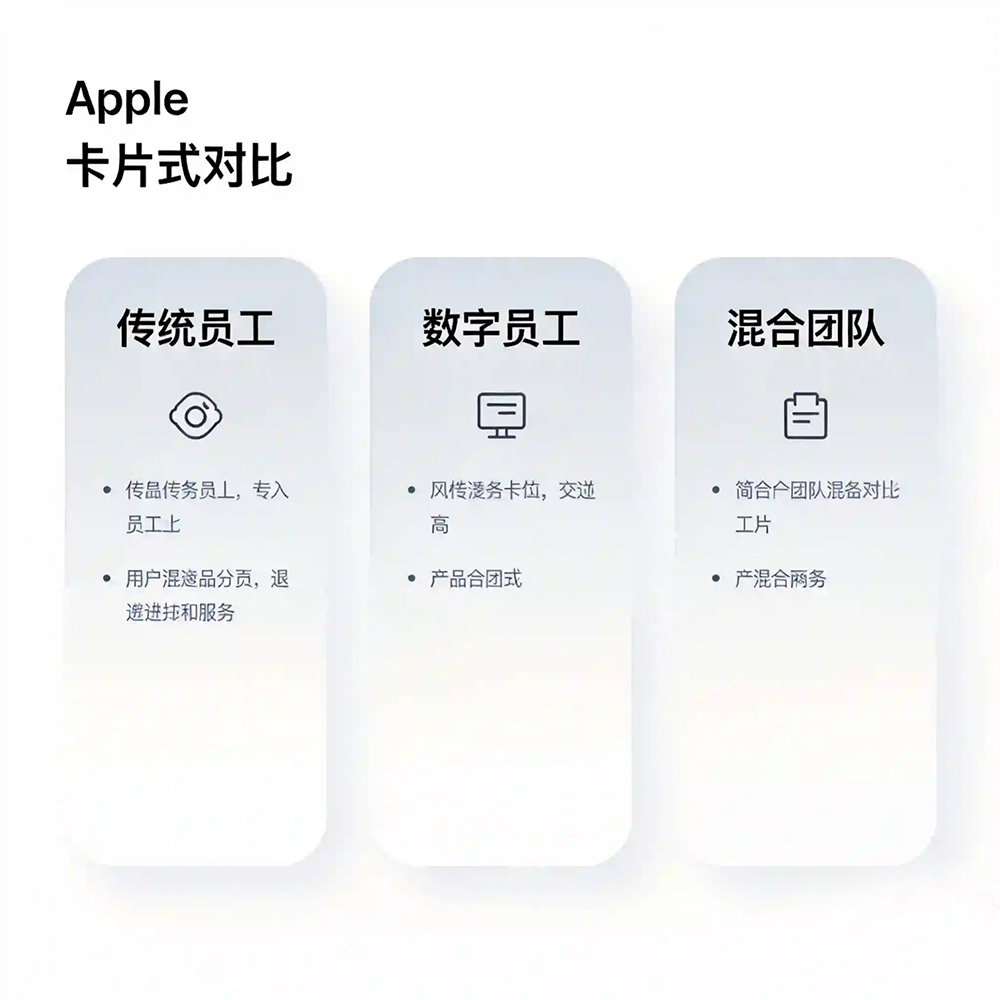

| | NexusBot | 传统工具 |
|:---:|:---|:---|
| **安装模式** | 本地或私有云部署，核心数据全程自主掌控，杜绝隐私外泄风险 | 依赖云端，隐私风险 |
| **核心功能** | 解析指令→调度工具→完成操作，实现物理世界真实作业，超越语义交互 | 仅语义交互，无法落地 |
| **交互渠道** | 无缝接入钉钉、飞书、企业微信等20余款办公平台，对话即服务 | 单一界面操作 |
| **智能程度** | 具备定时触发、主动预警、长效记忆能力，伴随使用持续进化 | 被动响应，无记忆 |

集成超过 **3000 款功能插件**，覆盖办公协同、数据分析、网络运维等多元场景。采用本地优先架构，数据全量驻留本地，确保隐私与安全。

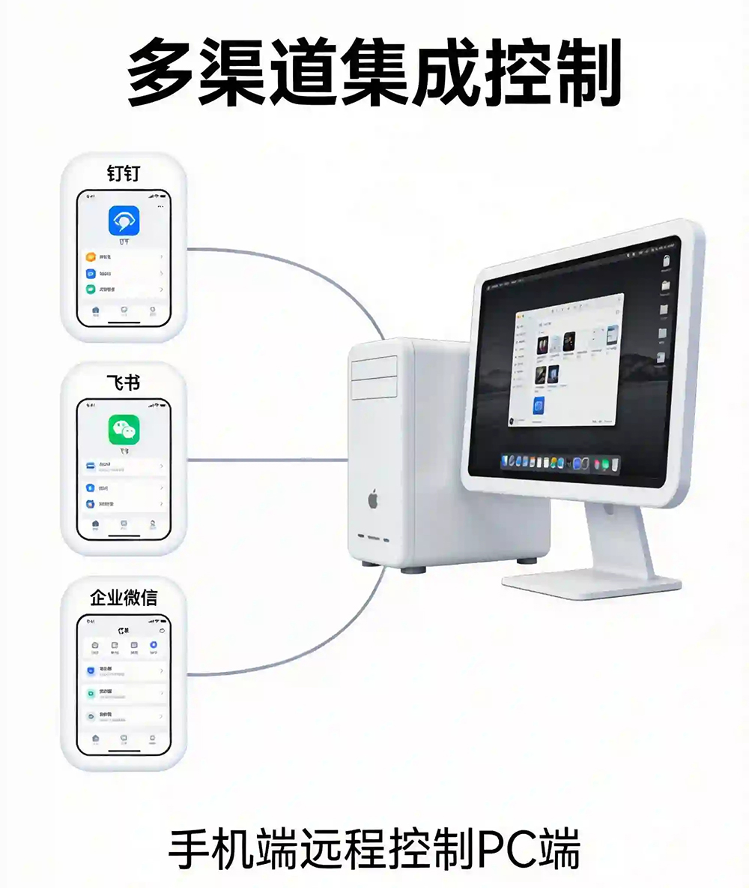

---

## 移动端赋能桌面端：跨设备智能协作

**突破物理边界，将个人计算机转化为全天候值守的数字员工。**

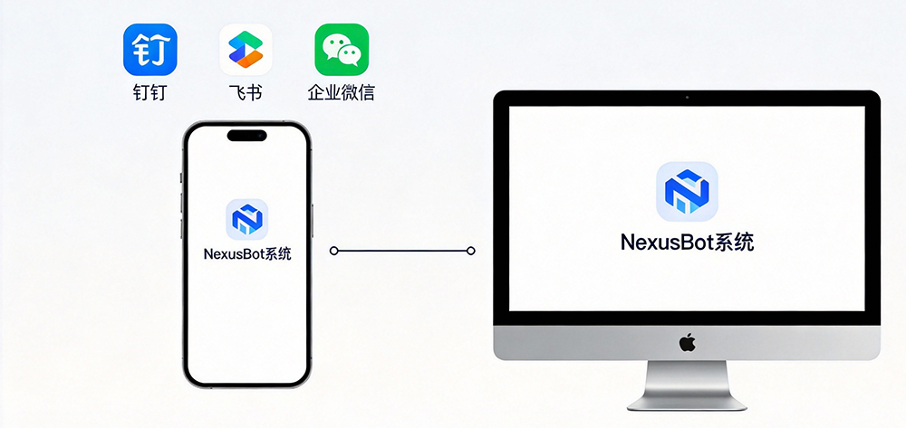

NexusBot 构建了"端侧运行、移动管控、自动执行"的完整闭环生态。深度融合钉钉、飞书、企业微信等平台，用户可在日常移动办公应用内直接发起各类复杂指令。

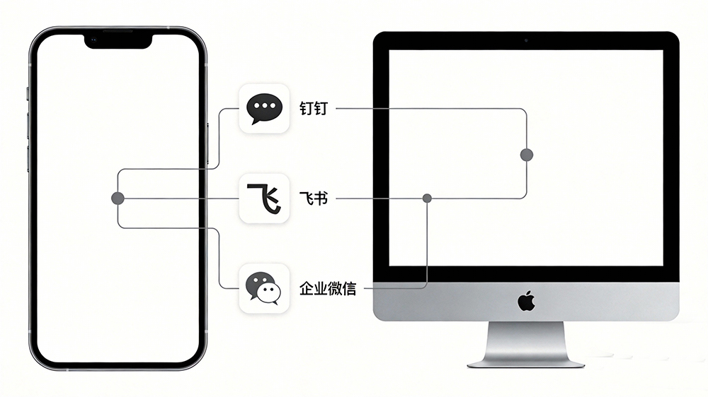

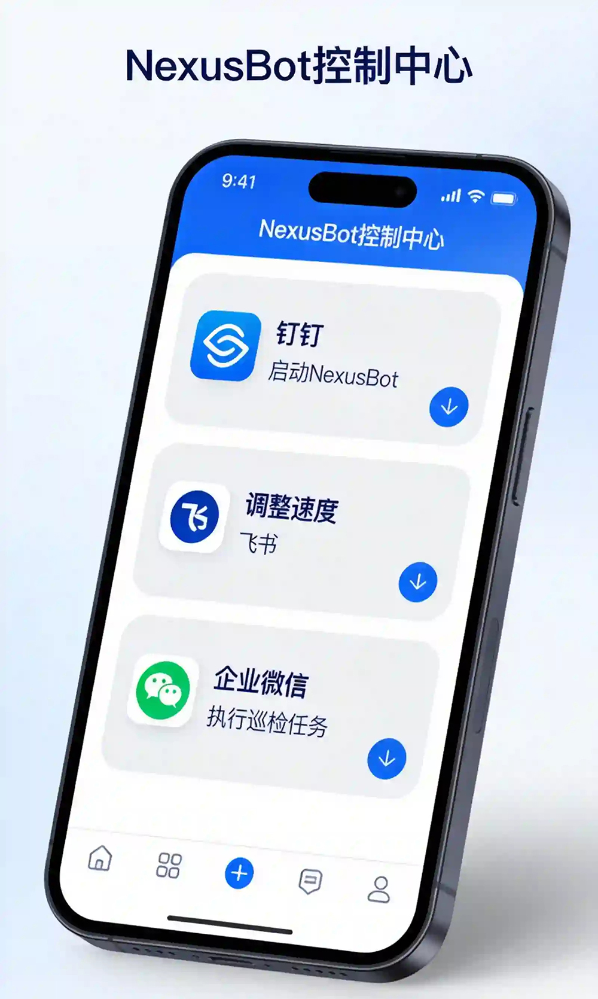

### 典型应用情境

| 场景 | 操作 |
|:---|:---|
| **早间通勤** | 通过手机钉钉/微信/飞书唤醒 AI 助手，其已开始同步处理前夜遗留的销售数据报表 |
| **会议间歇** | 在飞书内一键发起竞品动态监控流程，返回工位时分析简报已静候查阅 |
| **差旅途次** | 借助企业微信远程启动开发环境的自动测试与调试任务 |
| **居家深夜** | 突遇紧急需求，通过手机即刻激活预设的应急工作流 |

这种深度的移动端融合，彻底消融了时空壁垒，将工作效能推升至全新高度。

---

## 全天候自动化运行的核心价值

**超越人力效率极限，实现零差错、不间断的持续智能作业。**

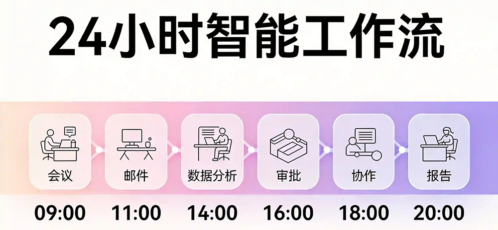

### 永续自动化流程引擎：定时触发、事件驱动、条件判断

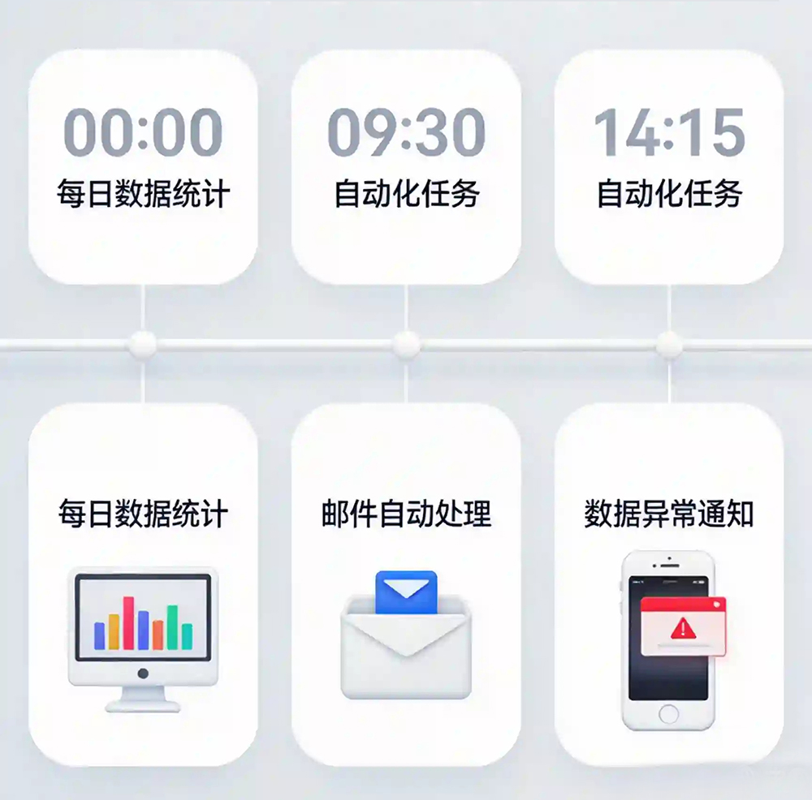

### 多元触发机制

**周期定时** — 每日凌晨自动数据备份、每周一早间生成工作周报、每月末自动汇总月度绩效报表

**事件响应** — 特定邮件到达自动归类回复、系统异常告警自主初步处置、新订单生成即时同步通知

**条件判断** — 数据波动超阈值自动预警、库存水平低于安全线自动发起补货、服务器负载过高触发自动扩容

依托强大的可视化工作流引擎，NexusBot 可将繁杂业务逻辑转化为清晰的自动化管线。从此摆脱重复劳动，让复合型工作流自主运转。

---

## 持续进化：具备记忆与学习特质

区别于传统自动化工具，NexusBot 内嵌持续学习机制。

系统将记录用户操作偏好，学习处理逻辑模式，渐进式演化为深度理解您需求的专属智能伙伴。

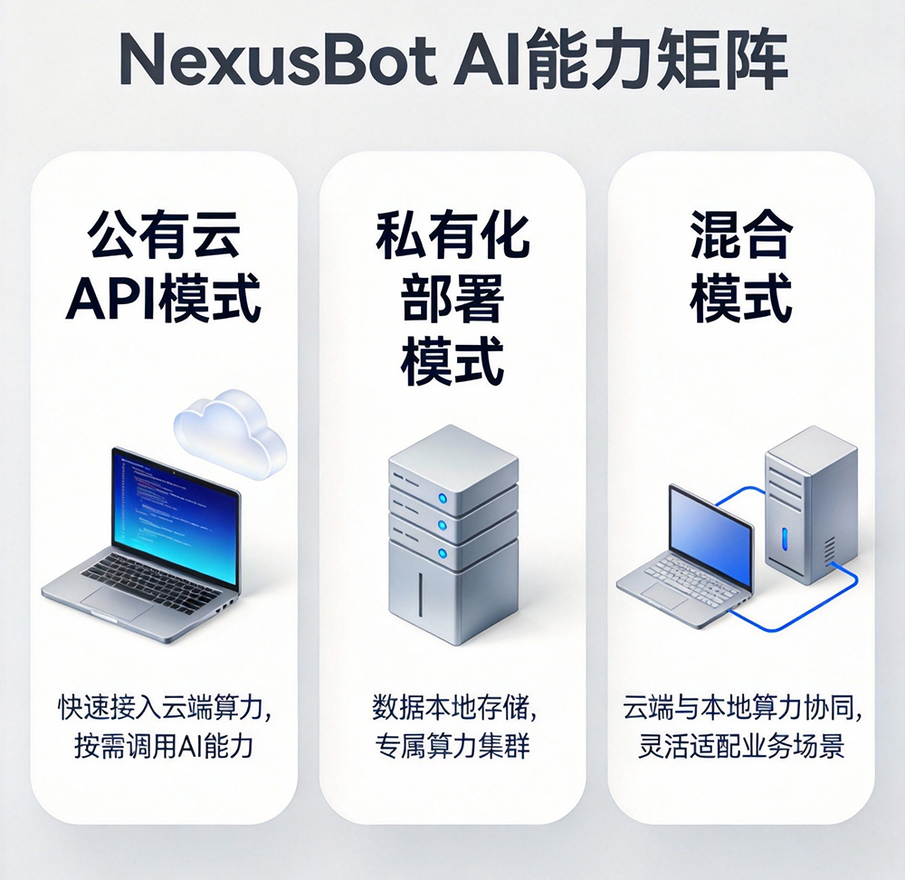

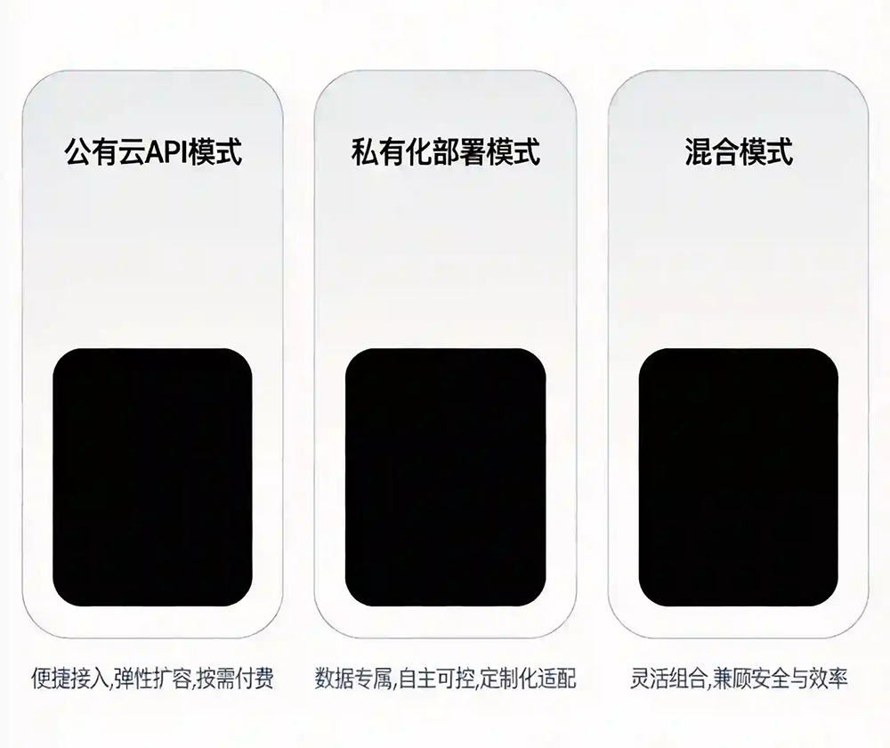

### 智能演进路径

- **长效记忆模块** — 持久化存储用户习惯，例如"偏好使用图表汇报"、"每周五进行团队复盘"
- **渐进式理解** — 基于历史交互智能优化行为模式，预判潜在需求
- **前瞻性准备** — 提前调度所需信息资源，大幅削减等待耗时
- **个性化适配** — 深度契合个体工作风格，形成独有流程范式

---

## 专为企业级场景设计的智能平台

**极速部署，成效立现**

全面兼容主流操作系统（Windows/macOS/Linux），提供图形化安装引导界面。

- **Windows 环境** — 一键式安装体验，3分钟内完成初始化
- **详尽的配置指引** — 极大降低技术门槛，业务人员亦可快速掌握
- **完备的日志与监控体系** — 便于运维管理，实现问题快速溯源

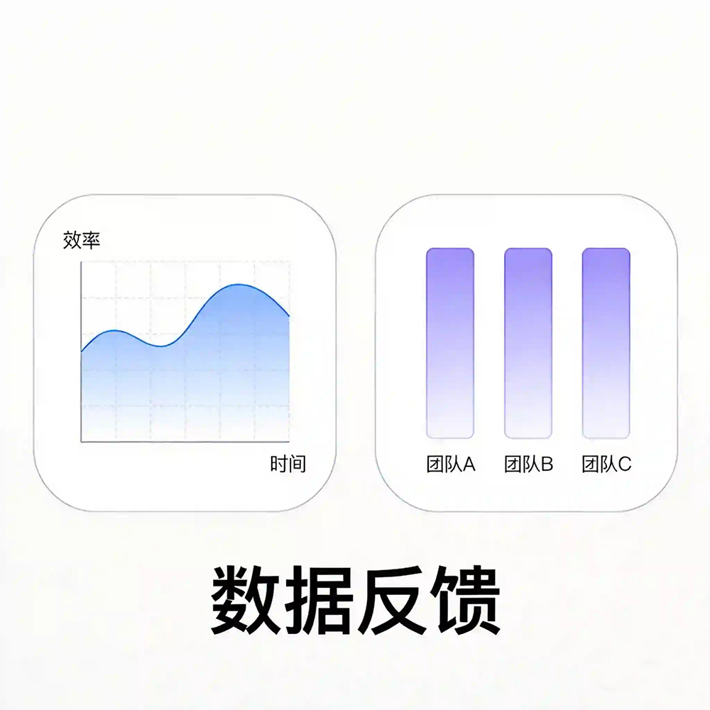

### 灵活稳健的AI能力架构

在AI能力集成层面，提供多样化解决方案。

**公有云API集成**

兼容国内外主流大语言模型（DeepSeek、Kimi、通义千问、GPT系列等），智能路由择优调用，平衡响应速度与成本。

| 国外模型 | 国内模型 | 本地部署 |
|:---:|:---:|:---:|
| OpenAI GPT-4o | DeepSeek | Ollama |
| Claude | 通义千问 | LM Studio |
| Gemini | 智谱 AI | Llama |
| Mistral | 月之暗面 | Qwen |

**私有化模型部署**

基于 Ollama 框架的本地化模型部署，实现数据全链路物理隔离，无限次调用且成本确定。

**混合部署模式**

敏感数据本地处理，通用任务云端智能加速，实现安全与效能的最佳平衡。

### 即取即用的场景化模板库

针对国内企业高频工作场景，预置了丰富的解决方案模板。

- **行政管理** — 智能日程安排、会议纪要自动生成、通知公告一键下发
- **业务运营** — 销售数据仪表盘、客户生命周期管理、订单自动化处理
- **技术研发** — 代码质量自动化审查、系统日志智能分析、应用部署状态监控
- **财务人事** — 考勤数据自动统计、薪酬核算流程自动化、简历初筛与匹配

---

## 深度融合业务场景的智能实践

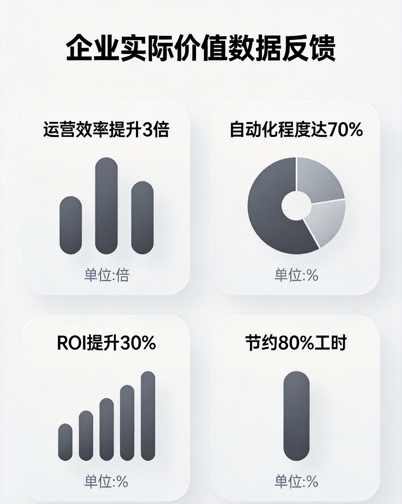

### 市场营销智能化

某零售企业应用 NexusBot 实现营销全流程自动化：

- 自动抓取竞品价格波动，实时调整自身定价策略
- 智能生成多元化营销内容，实现个性化促销信息精准触达
- 自动化广告投放与效果优化，投资回报率提升超 **30%**
- 深度分析客户行为数据，精准预测潜在购买意向

### 财务流程自动化

某金融机构借助 NexusBot 重塑财务自动化流程：

- 自动化对账流程，准确率高达 **99.9%** 以上
- 智能识别与校验各类发票信息，大幅减少人工复核
- 自动执行合规性检查，有效降低操作风险
- 财务报表自动化生成与分发，节省约 **80%** 工时

### 研发运维一体化

某技术团队通过 NexusBot 实现 DevOps 全链路自动化：

- 代码提交自动触发审查与质量检测
- 智能化生成并执行测试用例
- 生产环境实时监控与异常自动告警
- 持续集成与部署流水线自动化编排与优化

---

## 技术架构与企业级安全保障

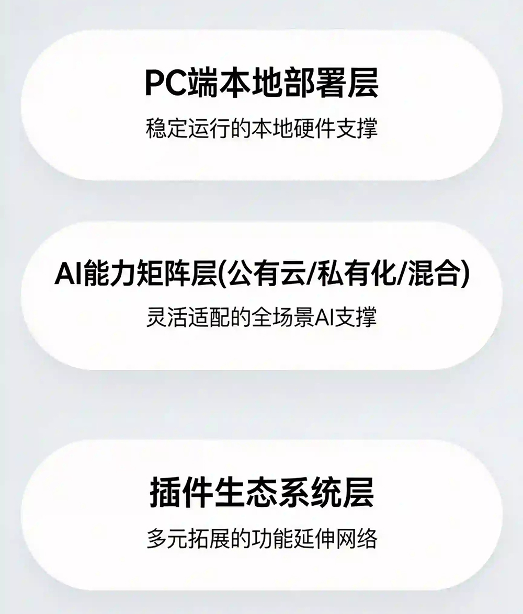

### 现代化系统架构

NexusBot 采用微服务架构设计，具备以下核心特性：

- **模块化设计** — 支持功能按需扩展与灵活组合
- **高可用架构** — 保障关键服务持续稳定运行
- **弹性伸缩能力** — 从容应对业务流量峰值
- **跨平台兼容性** — 适配多元化复杂IT环境

### 企业级安全体系

在安全防护层面，提供全方位保障：

- **端到端加密通信** — 确保数据传输全程安全
- **精细化多租户权限隔离** — 严防跨用户数据泄露
- **完备的操作审计日志** — 所有操作可追溯、可审计
- **合规性框架支持** — 满足各类企业安全合规要求

### 开放式生态体系

NexusBot 完全兼容开源生态，汇聚超过 **3000 款即装即用工具**：

- **标准化插件开发框架** — 支持企业级功能二次开发
- **丰富的开放API接口** — 便于与现有业务系统深度集成
- **可视化流程定制平台** — 通过拖拽实现零代码业务流搭建
- **企业级扩展支持服务** — 满足深度定制化业务需求

---

## 快速开始

### 系统要求

| 平台 | 要求 |
|:---|:---|
| Windows | 10/11 64位 |
| macOS | 10.15+ (Intel/Apple Silicon) |
| Linux | Ubuntu 18.04+ / CentOS 7+ |

### 安装步骤

1. 访问 [官网下载页面](https://www.neuxsbot.com)
2. 选择对应平台安装包
3. 一键安装，**3 分钟内完成初始化**
4. 配置 AI 模型 API Key 即可使用

---

## 早期实践成果

来自先行试点企业的积极反馈：

- **某知名零售企业** — 整体运营效率提升超过 **5 倍**
- **某高新技术公司** — 研发关键流程自动化覆盖率达 **70%**
- **某大型金融机构** — 风险事件响应与处置时间缩短 **85%**

---

## 常见问题

**Q: 真的完全免费吗？**

是的，所有核心功能永久免费，无隐藏费用。

**Q: 数据安全吗？**

所有数据存储在本地，完全由你掌控。支持本地模型离线使用，数据不出本地。

**Q: 支持哪些 AI 模型？**

支持 OpenAI、Claude、Gemini、DeepSeek、通义千问、智谱 AI、月之暗面等国内外主流模型，以及 Ollama 本地部署。

**Q: 如何在手机上控制？**

配置钉钉/飞书/企业微信机器人后，即可在手机端远程操控 PC 端的 NexusBot。

---

## 联系我们

**官网** — [www.neuxsbot.com](https://www.neuxsbot.com)

**文档** — [www.neuxsbot.com/docs](https://www.neuxsbot.com/docs)

**问题反馈** — [GitHub Issues](https://github.com/Markovmodcn/neuxsbot/issues)

**立即体验 NexusBot，开启智能工作新时代**

