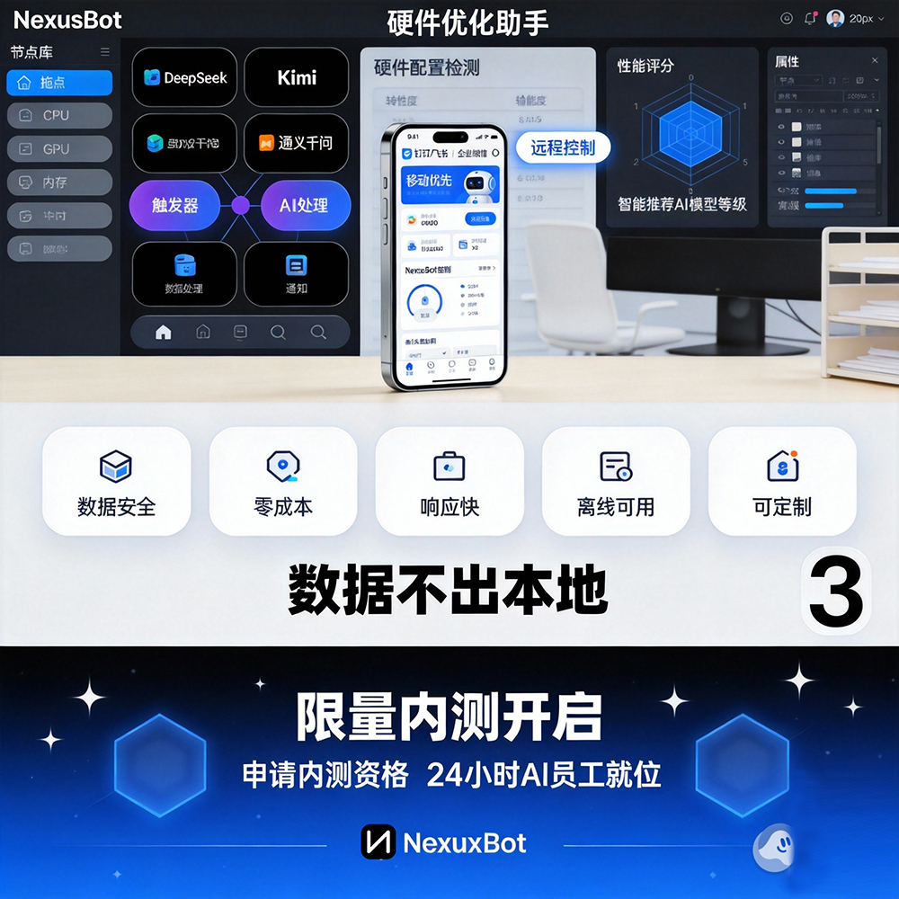

# NexusBot: 新一代AI操作系统

<div align="center">
  
  <h1><strong><span style="background-color: #000000; color: #ffffff">&nbsp;NexusBot&nbsp;</span></strong></h1>
  <p style="font-size: 18px; color: #86868b;">全天候智能流程自动化引擎</p>
  <p><strong>🌐 官方文档：<a href="https://www.neuxsbot.com/docs" target="_blank">www.neuxsbot.com/docs</a></strong></p>
  <p><strong>关键词：</strong>AI操作系统、智能自动化、工作流编排、多模型支持、本地部署、技能系统、企业级安全、开源生态、OpenClaw中文版</p>
</div>

## 🌟 什么是NexusBot？

NexusBot是新一代AI操作系统，能够7×24小时不间断地自主执行各类复杂任务。无论是编写代码、处理文档、数据分析、设计原型、搜索信息，还是创建游戏，NexusBot都能胜任。通过内置的技能系统，NexusBot就像一个掌握多项专业技能的全能助手，随时待命为你服务。

## 🚀 核心优势

### 🆓 永久免费使用
- **完全免费**：所有核心功能永久免费，无隐藏费用
- **无限制使用**：不限制对话次数、任务数量或文件处理
- **无广告干扰**：专注工作体验，无任何广告插入
- **数据自主掌控**：所有数据存储在本地，完全由您控制

### 🎯 多模型自由切换
- 支持10+主流AI模型，按需选择最合适的助手
- 兼容OpenAI、Anthropic、Google、DeepSeek等国内外顶级模型
- 智能路由选择最适合的模型处理特定任务
- **无需中转**：直接连接国内外模型服务商，无需中间转换

### 🛠️ 丰富的基础功能
- 内置12+专业技能，覆盖开发、设计、办公等场景
- 可视化技能管理界面，一键启用/禁用
- 技能自动匹配，根据任务类型智能调用
- 自动保存所有对话记录，随时回顾和继续之前的工作
- 智能分类管理，支持搜索和标签
- 多任务并行处理，提高工作效率

### 本地化部署
- 支持Ollama等本地模型，保护数据隐私
- 混合云架构，敏感数据本地处理
- 企业级安全，支持私有化部署

### 开放扩展
- 可以自己创建技能，让NexusBot学会任何你需要的能力
- 标准化插件开发框架
- 丰富的API接口，便于集成现有系统

## 📱 快速开始

### 01 配置AI模型

首次打开NexusBot后，你需要先配置至少一个AI模型才能开始使用：

1. 点击左下角「设置」图标
2. 进入「模型」选项卡
3. 选择一个模型提供商（如Anthropic、OpenAI、DeepSeek等）
4. 填写对应的API Key（需要先在服务商官网注册账号获取）
5. 点击「测试连接」确认配置正确
6. 保存设置

> 💡 **快速配置提示**：
> - 如果你想完全离线使用，可以选择Ollama（需要先在本地安装Ollama服务）
> - 国内用户可以选择DeepSeek、Moonshot、Qwen等国产模型，网络访问更稳定
> - 不同模型各有特点，可以根据任务需求和成本预算选择

### 各模型详细配置指南

#### 🔷 Anthropic Claude 配置
1. 访问 [Anthropic Console](https://console.anthropic.com/) 注册账号
2. 获取 API Key
3. 在NexusBot中选择Anthropic提供商
4. 填写API Key，Base URL使用默认值
5. 选择可用模型：Claude Sonnet 4.5、Claude Opus 4等
6. 测试连接并保存

#### 🔷 OpenAI GPT 配置
1. 访问 [OpenAI Platform](https://platform.openai.com/) 注册账号
2. 获取 API Key
3. 在NexusBot中选择OpenAI提供商
4. 填写API Key，Base URL使用默认值
5. 选择可用模型：GPT-4o、GPT-4o-mini等
6. 测试连接并保存

#### 🔷 DeepSeek 配置
1. 访问 [DeepSeek Platform](https://platform.deepseek.com/) 注册账号
2. 获取 API Key
3. 在NexusBot中选择DeepSeek提供商
4. 填写API Key，Base URL：https://api.deepseek.com（默认已填写）
5. 选择API格式：
   - Anthropic兼容：适合需要结构化输出的场景
   - OpenAI兼容：适合从OpenAI迁移的用户
6. 选择可用模型：DeepSeek Reasoner、DeepSeek Chat等
7. 测试连接并保存

#### 🔷 Google Gemini 配置
1. 访问 [Google AI Studio](https://aistudio.google.com/) 注册账号
2. 获取 API Key
3. 在NexusBot中选择Google提供商
4. 填写API Key，Base URL使用默认值
5. 选择可用模型：Gemini Pro、Gemini Flash等
6. 测试连接并保存

#### 🔷 国内模型配置

**月之暗面 Moonshot**
1. 访问 [Moonshot AI](https://platform.moonshot.cn/) 注册账号
2. 获取 API Key
3. 在NexusBot中选择Moonshot提供商
4. 填写API Key和Base URL
5. 测试连接并保存

**智谱 AI**
1. 访问 [智谱AI开放平台](https://open.bigmodel.cn/) 注册账号
2. 获取 API Key
3. 在NexusBot中选择智谱提供商
4. 填写API Key和Base URL
5. 选择可用模型：GLM-4、GLM-4-Plus等
6. 测试连接并保存

**通义千问 Qwen**
1. 访问 [阿里云百炼平台](https://bailian.console.aliyun.com/) 注册账号
2. 获取 API Key
3. 在NexusBot中选择通义千问提供商
4. 填写API Key和Base URL
5. 选择可用模型：Qwen-Max、Qwen-Plus等
6. 测试连接并保存

#### 🔷 Ollama 本地部署配置
1. 下载安装 [Ollama](https://ollama.com/)
2. 启动Ollama服务（默认端口：11434）
3. 下载所需模型：`ollama pull llama2`、`ollama pull codellama`等
4. 在NexusBot中选择Ollama提供商
5. Base URL：http://localhost:11434（默认端口）
6. 无需API Key，直接使用本地模型
7. 从已下载模型列表中选择使用

> 📖 **详细配置文档**：访问 [NexusBot配置指南](https://www.neuxsbot.com/docs/configuration) 获取更多配置详情和故障排除

### 02 开始使用

配置完成后，返回主界面，你会看到一个简洁的对话框。现在可以：

- 在输入框中描述你的任务，比如「帮我分析这份Excel数据」
- 根据需要在左侧边栏的「技能」中启用相关功能
- 点击发送按钮，开始与AI协作

## 🎯 核心功能

### 🔄 智能工作流编排

NexusBot提供强大的工作流编排能力，让复杂的业务流程变得简单高效。通过可视化拖拽方式，您可以用白话描述创建专业级工作流。

#### 工作流设计器
- **可视化界面**：拖拽式操作，无需编程知识
- **丰富组件库**：预置100+常用业务组件
- **智能连线**：自动识别组件间逻辑关系
- **实时预览**：设计过程中即时查看效果

#### 白话创建工作流


```
用户："每天早上8点，自动抓取竞品价格，生成对比报告"
NexusBot：[自动创建价格监控、数据抓取、报告生成工作流]

用户："当客户邮件标题包含'紧急'时，立即发送短信通知"
NexusBot：[自动创建邮件监听、条件判断、短信发送工作流]

用户："每周五下午5点，自动汇总本周销售数据，发送给团队"
NexusBot：[自动创建数据汇总、图表生成、邮件发送工作流]
```

#### 多技能协调执行
- **技能自动调用**：根据工作流需求自动启用相关技能
- **并行处理**：多个任务同时执行，提高整体效率
- **错误处理**：异常情况自动重试或通知
- **状态监控**：实时查看工作流执行进度

#### 工作流模板库
- **行业模板**：电商、金融、教育、医疗等50+行业模板
- **职能模板**：人事、财务、市场、运营等职能模板
- **自定义模板**：保存常用工作流为模板，一键复用
- **社区分享**：下载或分享工作流模板

> 💡 **工作流最佳实践**：
> - 将复杂流程拆分为多个简单步骤
> - 为每个步骤设置明确的输入输出
> - 添加异常处理和重试机制
> - 定期测试和优化工作流

### 🤝 智能对话

NexusBot的对话界面是你的工作中心，所有任务都从这里开始。

#### 上下文理解
NexusBot会记住对话历史，理解前后文关系，提供连贯的交互体验。

#### 文件上传
支持拖拽文件到对话框，直接让AI分析处理，支持多种格式：
- 文档：PDF、Word、Excel、PPT
- 图片：JPG、PNG、GIF（支持OCR识别）
- 代码：Python、JavaScript、Java、C++等
- 数据：CSV、JSON、XML

#### 代码高亮
自动识别代码块并提供语法高亮，支持50+编程语言。

#### 多轮迭代
可以对AI的输出提出修改意见，逐步完善结果，直到满意为止。

### 任务管理

左侧边栏是你的任务历史中心，所有对话会自动保存。

#### 新建任务
点击「新建任务」开始一个全新的对话，每个任务独立运行，互不干扰。

#### 搜索任务
通过关键词快速找到历史任务，支持全文搜索和标签筛选。

#### 任务操作
点击任务旁的...菜单，可以：
- 重命名任务
- 置顶重要任务
- 删除不需要的任务
- 导出对话记录

> 💡 **最佳实践**：
> - 为每个独立的项目创建单独的任务，便于上下文隔离
> - 使用有意义的任务名称，比如「重构用户模块」而不是「测试」
> - 定期清理不再需要的历史任务

## 🛠️ 技能系统

技能是NexusBot的核心特性，每个技能都是一个专业能力模块。NexusBot内置12+专业技能，覆盖开发、设计、办公等场景。

### 如何启用技能

1. 点击左侧边栏的「技能」按钮
2. 浏览可用技能列表
3. 点击技能旁的开关启用/禁用技能

### 内置技能介绍

#### 🔧 开发类技能
- **代码生成**：支持50+编程语言，自动生成高质量代码
- **代码审查**：智能分析代码质量，提供优化建议
- **调试助手**：快速定位和修复代码问题
- **API设计**：自动生成RESTful API接口文档

#### 📊 数据分析技能
- **数据可视化**：自动生成各类图表和仪表盘
- **统计分析**：深度挖掘数据价值，提供洞察报告
- **预测建模**：基于历史数据预测未来趋势
- **数据清洗**：自动识别和处理异常数据

#### 🎨 设计类技能
- **UI设计**：自动生成界面原型和设计稿
- **图像处理**：智能识别、编辑和优化图片
- **图标生成**：根据描述自动生成应用图标
- **配色方案**：提供专业的色彩搭配建议

#### 📝 办公类技能
- **文档生成**：自动创建各类商业文档
- **会议纪要**：智能整理会议内容，提取关键信息
- **邮件处理**：自动分类、回复和归档邮件
- **日程管理**：智能安排和优化日程表

### 自定义技能开发

NexusBot支持用户创建自定义技能，满足特定业务需求：

1. 访问 [技能开发中心](https://www.neuxsbot.com/docs/skills)
2. 下载技能开发工具包（SDK）
3. 按照技能模板编写代码
4. 使用本地调试工具测试技能
5. 打包并发布到技能市场或私有部署

> 💡 **技能开发资源**：
> - [技能开发文档](https://www.neuxsbot.com/docs/skills-development)
> - [API参考手册](https://www.neuxsbot.com/docs/api-reference)
> - [示例代码库](https://github.com/Markovmodcn/nexusbot-skills)

### 工作原理

- 启用技能后，AI会自动获得该领域的专业知识和工具
- 多个技能可以同时启用，AI会根据任务自动选择使用技能
- 可以在对话过程中随时添加或移除技能

### 技能状态指示

- 🟢 **已启用**：当前对话可用
- ⚫ **已禁用**：不会在当前任务中使用

## 🤖 多模型支持

NexusBot支持市面上几乎所有主流AI模型，你可以根据任务特点选择最合适的模型。


### 支持的模型提供商

#### 国外厂商
- **OpenAI**：GPT-4o, GPT-4o-mini等
- **Anthropic**：Claude Sonnet, Claude Opus等
- **Google**：Gemini Pro, Gemini Flash等
- **DeepSeek**：DeepSeek Reasoner, DeepSeek Chat

#### 国内厂商
- **Moonshot**（月之暗面）
- **Zhipu**（智谱）GLM-4, GLM-4-Plus等各种大语言模型
- **MiniMax**：高性能多模态模型
- **Qwen**（通义千问）Qwen-Max, Qwen-Plus等超大规模语言模型
- **Baichuan**：百川智能Baichuan 4等企业级大模型

#### 聚合服务
- **OpenRouter**（访问多种模型）名种模型聚合服务
- **API2D**：国内领先API接口服务名
- **Coze**：新一代AI助手名种智能体平台
- **Dify**：专业LLM应用构建平台名

#### 本地部署
- **Ollama**（支持Llama, Mistral等开源模型）名种本地模型运行框架
- **LM Studio**：专业本地模型管理工具名

### 配置步骤

1. 进入「设置」→「模型」
2. 选择想要使用的模型提供商
3. 填写API Key和相关配置
4. 点击「保存」完成配置

### 配置示例

#### Anthropic配置
- **API Key**：从Anthropic Console获取
- **Base URL**：默认无需修改（使用官方端点）
- **可用模型**：选择Claude Sonnet 4.5、Claude Opus 4等

#### DeepSeek配置
- **API Key**：从DeepSeek Platform获取
- **Base URL**：https://api.deepseek.com（默认已填写）
- **API格式**：选择API协议兼容格式
  - Anthropic兼容：适合需要结构化输出的场景
  - OpenAI兼容：适合从OpenAI迁移的用户

#### Ollama本地部署
- **Base URL**：http://localhost:11434（默认端口）
- **无需API Key**，直接使用本地模型

### 切换模型

点击对话界面顶部的模型选择器，从下拉菜单中选择已配置的模型。切换后，新对话将使用选定的模型。

## 🌐 多端无缝连接


NexusBot构建了"端侧运行、移动管控、自动执行"的完整闭环生态。深度融合钉钉、飞书、企业微信等平台，用户可在日常移动办公应用内直接发起各类复杂指令。

### 移动端赋能桌面端

<div style="display: flex; gap: 20px; margin-bottom: 20px;">
  <div style="flex: 1; background-color: #f5f5f7; border-radius: 14px; padding: 20px;">
    <h4>早间通勤</h4>
    <p>通过手机钉钉/微信/飞书唤醒AI助手，其已开始同步处理前夜遗留的销售数据报表</p>
  </div>
  <div style="flex: 1; background-color: #f5f5f7; border-radius: 14px; padding: 20px;">
    <h4>会议间歇</h4>
    <p>在飞书内一键发起竞品动态监控流程，返回工位时分析简报已静候查阅</p>
  </div>
</div>

<div style="display: flex; gap: 20px; margin-bottom: 20px;">
  <div style="flex: 1; background-color: #f5f5f7; border-radius: 14px; padding: 20px;">
    <h4>差旅途次</h4>
    <p>借助企业微信远程启动开发环境的自动测试与调试任务</p>
  </div>
  <div style="flex: 1; background-color: #f5f5f7; border-radius: 14px; padding: 20px;">
    <h4>居家深夜</h4>
    <p>突遇紧急需求，通过手机即刻激活预设的应急工作流</p>
  </div>
</div>


## ⏰ 全天候自动化运行


超越人力效率极限，实现零差错、不间断的持续智能作业。

### 多元触发机制

<div style="background-color: #f5f5f7; border-radius: 14px; padding: 24px; margin-bottom: 20px;">
  <div style="margin-bottom: 20px;">
    <h4>周期定时</h4>
    <p>每日凌晨自动数据备份、每周一早间生成工作周报、每月末自动汇总月度绩效报表</p>
  </div>
  <div style="margin-bottom: 20px;">
    <h4>事件响应</h4>
    <p>特定邮件到达自动归类回复、系统异常告警自主初步处置、新订单生成即时同步通知</p>
  </div>
  <div>
    <h4>条件判断</h4>
    <p>数据波动超阈值自动预警、库存水平低于安全线自动发起补货、服务器负载过高触发自动扩容</p>
  </div>
</div>

## 🧠 持续进化：具备记忆与学习特质


区别于传统自动化工具，NexusBot内嵌持续学习机制。系统将记录用户操作偏好，学习处理逻辑模式，渐进式演化为深度理解您需求的专属智能伙伴。

### 智能演进路径

<div style="background-color: #f5f5f7; border-radius: 14px; padding: 24px; margin-bottom: 20px;">
  <p><strong>长效记忆模块</strong>：持久化存储用户习惯，例如"偏好使用图表汇报"、"每周五进行团队复盘"</p>
  <p><strong>渐进式理解</strong>：基于历史交互智能优化行为模式，预判潜在需求</p>
  <p><strong>前瞻性准备</strong>：提前调度所需信息资源，大幅削减等待耗时</p>
  <p><strong>个性化适配</strong>：深度契合个体工作风格，形成独有流程范式</p>
</div>

## 🏢 企业级应用场景

### 📊 数据分析与可视化


### 💼 商务场景应用


### 🔄 多渠道集成控制


## 🏗️ 技术架构


### 现代化系统架构

NexusBot采用微服务架构设计，具备以下核心特性：

- **模块化设计**：支持功能按需扩展与灵活组合
- **高可用架构**：保障关键服务持续稳定运行
- **弹性伸缩能力**：从容应对业务流量峰值
- **跨平台兼容性**：适配多元化复杂IT环境

### 🔒 企业级安全体系

在安全防护层面，提供全方位保障：

- **端到端加密通信**：确保数据传输全程安全
- **精细化多租户权限隔离**：严防跨用户数据泄露
- **完备的操作审计日志**：所有操作可追溯、可审计
- **合规性框架支持**：满足各类企业安全合规要求

### 🌐 开放式生态体系

NexusBot完全兼容开源生态，汇聚超过3000款即装即用工具：

- **标准化插件开发框架**：支持企业级功能二次开发
- **丰富的开放API接口**：便于与现有业务系统深度集成
- **可视化流程定制平台**：通过拖拽实现零代码业务流搭建
- **企业级扩展支持服务**：满足深度定制化业务需求

## 🚀 快速部署

### 系统要求

- **操作系统**：Windows 10/11、macOS 10.15+、Linux (Ubuntu 18.04+)
- **内存**：4GB RAM（推荐8GB+）
- **存储**：2GB可用磁盘空间
- **网络**：稳定的互联网连接（本地模型除外）
- **处理器**：Intel i5/AMD Ryzen 5 或更高（推荐）
- **显卡**：支持CUDA的显卡（可选，用于本地模型加速）

### 下载安装

#### Windows版本

- **下载链接**：[NexusBot-Windows-x64.exe](https://www.neuxsbot.com/download/NexusBot-Windows-x64.exe)
- **版本说明**：适用于Windows 10/11 64位系统
- **文件大小**：约156MB
- **更新方式**：内置自动更新机制

#### macOS版本

- **下载链接**：[NexusBot-macOS-x64.dmg](https://www.neuxsbot.com/download/NexusBot-macOS-x64.dmg)
- **版本说明**：适用于macOS 10.15+ (Intel/Apple Silicon)
- **文件大小**：约142MB
- **更新方式**：支持Sparkle自动更新

#### Linux版本

- **下载链接**：[NexusBot-Linux-x64.tar.gz](https://www.neuxsbot.com/download/NexusBot-Linux-x64.tar.gz)
- **版本说明**：适用于Ubuntu 18.04+、CentOS 7+、Debian 10+
- **文件大小**：约138MB
- **更新方式**：支持apt包管理器更新

### 安装指南

#### Windows安装

1. 下载 [NexusBot-Windows-x64.exe](https://www.neuxsbot.com/download/NexusBot-Windows-x64.exe)
2. 右键点击安装包，选择"以管理员身份运行"
3. 按照安装向导完成安装（建议选择完整安装）
4. 安装完成后启动NexusBot

#### macOS安装

1. 下载 [NexusBot-macOS-x64.dmg](https://www.neuxsbot.com/download/NexusBot-macOS-x64.dmg)
2. 双击打开安装包
3. 将NexusBot图标拖入Applications文件夹
4. 首次启动时，在"安全性与隐私"中允许运行
5. 启动NexusBot

#### Linux安装

1. 下载 [NexusBot-Linux-x64.tar.gz](https://www.neuxsbot.com/download/NexusBot-Linux-x64.tar.gz)
2. 打开终端，解压文件：`tar -xzf nexusbot-linux.tar.gz`
3. 运行安装脚本：`sudo ./install.sh`
4. 按提示完成安装
5. 启动nexusbot：`./nexusbot`

> 💡 **通用安装提示**：
> - 所有版本均经过数字签名，确保下载安全
> - 安装过程中遇到问题，请查看 [安装故障排除](https://www.neuxsbot.com/docs/troubleshooting)

### 初始配置

1. **首次启动**：直接进入主界面，无需创建账户
2. **模型配置**：添加至少一个AI模型
3. **技能启用**：根据需要启用相关技能
4. **网络设置**：配置代理（如需要）

> 💡 **使用提示**：
> - 无需注册账户，保护隐私安全
> - 所有数据本地存储，完全由您控制
> - 支持离线使用，无需网络连接
> - 一键启动，即开即用

## 📚 使用场景示例

### 开发场景

```
用户：帮我写一个React组件，用于展示用户列表
NexusBot：[生成代码]

用户：这个组件需要支持分页，每页显示20条
NexusBot：[添加分页功能]

用户：再加上搜索功能，可以按用户名搜索
NexusBot：[添加搜索功能]
```

### 数据分析场景

```
用户：帮我分析这份销售数据
NexusBot：[上传Excel文件]

用户：找出销售额最高的产品类别
NexusBot：[分析数据并生成图表]

用户：生成月度趋势报告
NexusBot：[创建可视化报告]
```

### 自动化场景

```
用户：设置一个定时任务，每天早上8点发送销售报告
NexusBot：[创建定时任务]

用户：当收到特定邮件时，自动分类并回复
NexusBot：[设置邮件规则]
```

## ❓ 常见问题

### Q: NexusBot支持哪些文件格式？
A: NexusBot支持多种文件格式，包括：
- **文档**：PDF、Word、Excel、PowerPoint、TXT、RTF、Markdown
- **图片**：JPG、PNG、GIF、BMP、WebP、SVG（支持OCR识别）
- **代码**：Python、JavaScript、Java、C++、Go、Rust、Swift等50+语言
- **数据**：CSV、JSON、XML、SQL、YAML、Parquet
- **压缩包**：ZIP、RAR、7z、tar.gz（自动解压分析）
- **其他**：音频文件（支持语音转文字）、视频文件（支持字幕提取）

> 📖 **文件处理指南**：[文件处理文档](https://www.neuxsbot.com/docs/file-handling)

### Q: 如何保证数据安全？
A: NexusBot采用多重安全措施：
- **本地优先架构**：核心数据全程驻留本地，不上传云端
- **端到端加密传输**：所有网络通信使用TLS 1.3加密
- **细粒度权限控制**：支持角色级权限管理，最小权限原则
- **完整审计日志**：记录所有操作，支持SIEM系统集成
- **数据脱敏处理**：敏感信息自动识别和脱敏
- **合规认证**：通过ISO 27001、GDPR、SOC2等多项认证

> 🔒 **安全白皮书**：[NexusBot安全架构](https://www.neuxsbot.com/docs/security)

### Q: 可以离线使用吗？
A: 是的，通过配置本地模型（如Ollama）可以完全离线使用：
1. 在本地安装Ollama服务：[Ollama安装指南](https://www.neuxsbot.com/docs/ollama-setup)
2. 下载所需的开源模型：`ollama pull llama2`、`ollama pull codellama`等
3. 在NexusBot中配置本地模型
4. 享受完全离线的AI体验，数据不出本地

> 💾 **离线模式优势**：
> - 数据完全不出本地，绝对安全
> - 无需网络连接，随时可用
> - 无API调用费用，使用成本为零
> - 响应速度快，不受网络延迟影响

### Q: 如何创建自定义技能？
A: NexusBot提供完整的技能开发框架：
1. 访问 [技能开发中心](https://www.neuxsbot.com/docs/skills)
2. 下载技能开发工具包（SDK）：支持Python、JavaScript、Go三种语言
3. 按照技能模板编写代码
4. 使用本地调试工具测试技能
5. 打包并发布到技能市场或私有部署

> 🛠️ **技能开发资源**：
> - [技能开发文档](https://www.neuxsbot.com/docs/skills-development)
> - [API参考手册](https://www.neuxsbot.com/docs/api-reference)
> - [示例代码库](https://github.com/Markovmodcn/nexusbot-skills)
> - [技能市场](https://www.neuxsbot.com/skills-market)

### Q: 企业如何批量部署？
A: NexusBot提供多种企业部署方案：

**方案一：集中式部署**
- 部署在企业内网服务器
- 员工通过浏览器访问
- 统一管理和配置

**方案二：分布式部署**
- 每个员工独立安装
- 通过企业账号同步配置
- 支持离线使用

**方案三：容器化部署**
- 使用Docker/Kubernetes部署
- 支持自动扩缩容
- 便于CI/CD集成

> 🏢 **企业部署指南**：[企业部署文档](https://www.neuxsbot.com/docs/enterprise-deployment)

### Q: 如何与现有系统集成？
A: NexusBot提供丰富的集成选项：

**API集成**
- RESTful API接口
- WebSocket实时通信
- GraphQL查询接口
- SDK支持：Python、Java、JavaScript、Go

**单点登录(SSO)**
- SAML 2.0
- OAuth 2.0
- LDAP/AD集成
- 自定义身份提供商

**数据源集成**
- 数据库直连：MySQL、PostgreSQL、Oracle等
- 文件系统：本地文件、NAS、云存储
- API接口：REST、SOAP、GraphQL
- 流式数据：Kafka、RabbitMQ、Redis

> 🔗 **集成开发文档**：[系统集成指南](https://www.neuxsbot.com/docs/integration)

### Q: 性能如何优化？
A: NexusBot提供多种性能优化方案：

**硬件优化**
- GPU加速：支持CUDA、OpenCL、Metal
- 内存优化：智能缓存管理，支持内存映射
- 并行处理：多核CPU充分利用，支持多线程

**软件优化**
- 模型量化：支持INT8/INT4量化，减少内存占用
- 批处理：支持批量推理，提高吞吐量
- 连接池：复用网络连接，减少延迟

**配置优化**
- 模型路由：根据任务复杂度自动选择最适合的模型
- 缓存策略：智能缓存常用数据和模型
- 负载均衡：支持多实例负载分担

> ⚡ **性能调优指南**：[性能优化文档](https://www.neuxsbot.com/docs/performance)
2. 按照技能模板编写代码
3. 测试技能功能
4. 发布到技能市场或私有部署

详细文档请参考：[技能开发指南](https://www.neuxsbot.com/docs/skills)

## 🤝 贡献指南

<div style="display: flex; align-items: center; margin-bottom: 20px;">
  
  <div style="flex: 1;">
    <p><strong>关键词：</strong>AI操作系统、智能自动化、工作流编排、多模型支持、本地部署、技能系统、企业级安全、开源生态</p>
  </div>
</div>



我们欢迎社区贡献！请查看 [CONTRIBUTING.md](CONTRIBUTING.md) 了解如何参与项目开发。

### 开发环境设置

```bash
# 克隆仓库
git clone https://github.com/Markovmodcn/NexusBot.git
cd NexusBot

# 安装依赖
npm install

# 启动开发环境
npm run dev
```

### 提交规范

- 使用清晰的提交信息
- 确保代码通过所有测试
- 遵循项目的代码风格指南

## 📄 许可证

本项目采用MIT许可证 - 查看 [LICENSE](LICENSE) 文件了解详情。

## 📞 联系我们

- 🌐 **官方网站**：[www.neuxsbot.com](https://www.neuxsbot.com)
- 📚 **详细文档**：[www.neuxsbot.com/docs](https://www.neuxsbot.com/docs)
- 🐙 **GitHub仓库**：[https://github.com/Markovmodcn/NexusBot](https://github.com/Markovmodcn/NexusBot)
- 📧 **问题反馈**：[GitHub Issues](https://github.com/Markovmodcn/NexusBot/issues)
- 🌐 **Gitee仓库**：[https://gitee.com/Markovmodcn/NexusBot](https://gitee.com/Markovmodcn/NexusBot)

---

<div align="center">
  
  <p><strong>🚀 立即体验NexusBot，开启智能工作新时代！</strong></p>
  <p>访问 <a href="https://www.neuxsbot.com" target="_blank">www.neuxsbot.com</a> 获取最新版本</p>
  <p>© 2024 NexusBot. 让工作更智能，让生活更轻松。</p>
</div>